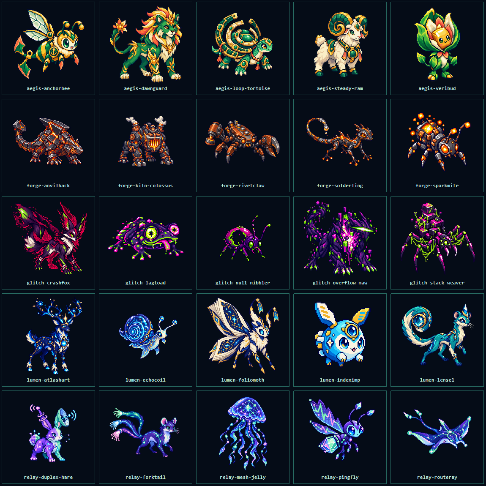

# Codekin

[简体中文](README.zh-CN.md)

Codekin is a creature-collection and match-three battle plugin for DeepSeek Harness Web. It turns
high-level DSH runtime outcomes into local game events without changing prompts, tools, model
requests, or agent behavior.

## What it includes

- Five clear computing attributes—Compute, Compile, Network, Guard, and Glitch—and 25 initial Codekin.
- Five capture-core qualities earned through ordinary DSH use.
- Event-driven encounters, including uncommon creatures associated with failed or recovered runs.
- Up to seven wild map residents, with long-lived common finds and shorter windows for high-level rare encounters.
- Mixed DSH activity replenishes the least represented matching region; after one region grows beyond five residents, repeated single-attribute activity is diverted to a scarcer region.
- Ordinary wild levels stay between the lowest and highest levels in the complete roster; Nova and Origin appear as over-level special challenges.
- A 2D region map, 7×7 match-three battles, capture, a three-Codekin squad, and a creature index.
- Five attribute tiles arranged in a closed advantage loop, with strong and resisted damage.
- Level 1–100 progression, five qualities of growth material, idle supplies, and local persistence.
- A persisted enable switch under DSH Settings → Codekin; disabling pauses event rewards and idle time without deleting progress.
- A two-step release flow in Squad that returns one same-quality growth material regardless of the Codekin's level.
- Three base actions per active Codekin; direct match-four refunds an action and match-five adds one.
- A wild-battle turn may be ended early to preserve a low-runtime capture target.
- Damage from all three squad stages is queued and resolved as one team strike at the end of the cycle.
- Wild Codekin use separate Boss scaling and can telegraph single-target attacks, party-wide attacks,
  tile locks, freezes, and phase shields according to their level and quality.
- Matching a Codekin's attribute builds command points, and every Codekin has one passive plus one active ability.
- Match-four, match-five, and intersecting clears create row, column, burst, and origin tiles.
- Host-validated game actions and atomic local persistence.

## How it works

Use DSH normally. Completed activity can award a capture core and create an encounter. Open the
Codekin launcher to explore the map, build a squad, and enter a command match encounter. Swap
adjacent tiles to queue compute damage and charge matching squad members; after all three squad stages, a
single team strike resolves against the Boss. Defeating wild Codekin drops growth materials. A
capture decision appears after a qualifying team strike, with odds based on remaining runtime and the
capture-core quality. Encounter level and quality reflect effective activity time in the current session.
Codekin does not submit prompts, invoke tools, or alter
conversations.

## Data behavior

Game progress is stored locally by the plugin. Codekin records bounded game events and aggregate
runtime outcomes; it does not store prompt text, assistant responses, tool arguments, commands,
workspace paths, or raw error bodies.

## Compatibility and status

This repository currently contains the `0.2.0-rc.3` playtest build for DeepSeek Harness Web
`0.1.0-rc.5`. The package remains private while gameplay and balance are being evaluated.

## License

MIT
