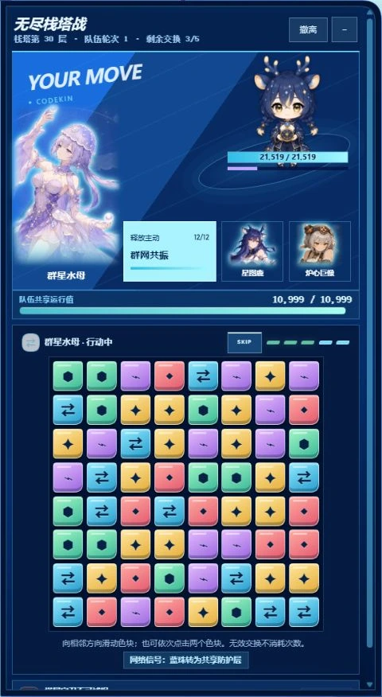
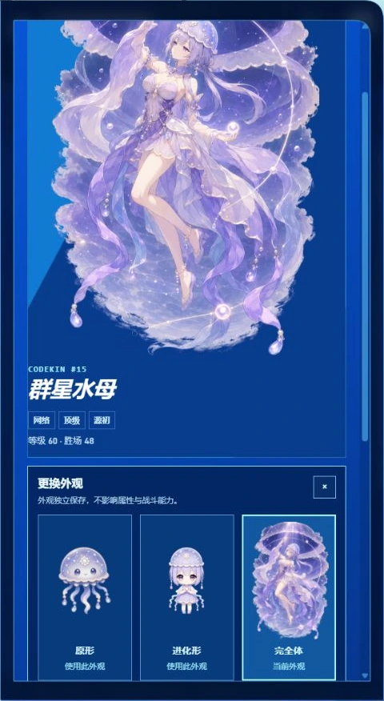

# Codekin

[简体中文](README.zh-CN.md) · [GitHub Releases](https://github.com/Nath-Vikky/dsh-codekin/releases) · [npm package](https://www.npmjs.com/package/@nath-vikky/dsh-codekin) · [Engine and content architecture](docs/architecture.md)

Codekin is a creature-collection and match-three battle plugin for DeepSeek Harness Web. Ordinary DSH activity creates local encounters and supplies; collect Codekin, build a three-member squad, and challenge the Endless Stack Tower. The plugin does not change prompts, tools, model requests, or agent behavior.

## In-game preview

Actual Codekin `0.3.7-rc.1` screens captured in an isolated demonstration profile on DSH `0.1.2-rc.1`, with `dsh-web 0.3.17` installed.

<p align="center">
  
  
  
</p>

<p align="center"><sub>Ultimate battle portraits · full-scene character details · three appearance choices</sub></p>

<p align="center">
  
  
</p>

<p align="center"><sub>Collection and squad management · Endless Stack Tower</sub></p>

### The first 25 Codekin


## Install and enable

### Current release: Codekin `0.3.8-rc.1`

This release targets **DSH `0.1.5-rc.1` + dsh-web `0.3.20`**. As of September 10, 2026, [dsh-web `0.3.20`](https://github.com/zhu1090093659/dsh-web/releases/tag/v0.3.20) has moved its SDK and [bundled desktop host](https://github.com/zhu1090093659/dsh-web/blob/v0.3.20/desktop/runtime/host/package.json) to DSH `0.1.5-rc.1`.

`0.3.8-rc.1` aligns the host minimum and SDK dependencies, and handles Session V3 tool-result rewrites so history maintenance does not count again toward activity rewards. The game engine, content pack, and save format remain at the `0.3.7-rc.1` baseline; Codekin saves continue to use the same `DSH_HOME/codekinsave` directory.

Install from npm with explicit versions:

```sh
pnpm dlx @deepseek-ai/dsh@0.1.5-rc.1 plugin --profile web add @nath-vikky/dsh-codekin@0.3.8-rc.1
```

The same release is also available as a GitHub Release tarball:

```sh
pnpm dlx @deepseek-ai/dsh@0.1.5-rc.1 plugin --profile web add --ignore-scripts https://github.com/Nath-Vikky/dsh-codekin/releases/download/v0.3.8-rc.1/nath-vikky-dsh-codekin-0.3.8-rc.1.tgz
```

Use the same `DSH_HOME` as your existing DSH installation so the command updates the intended profile. Restart DSH Web, then enable **DSH Settings → Codekin**. The draggable launcher opens the portrait game window and becomes a gift reminder when idle supplies are ready.

The npm `latest` tag points to **`0.3.8-rc.1`**. npm and GitHub Release use the same package archive. Release tags and active development branches include reviewed runtime bundles for source installs.

### Version pairings

| Codekin | DSH host | Distribution / status |
| --- | --- | --- |
| **`0.3.8-rc.1`** | **`0.1.5-rc.1`** | npm `latest` and current GitHub release; tested with dsh-web `0.3.20` |
| `0.3.7-rc.1` | `0.1.2-rc.1` | Previous npm / GitHub release; tested with dsh-web `0.3.17` |
| `0.3.6-rc.1` | `0.1.2-rc.1` | Previous GitHub compatibility release |
| `0.3.6-alpha.3` | `0.1.2-alpha.5` | Historical GitHub release |
| `0.3.5-alpha.2` | `0.1.2-alpha.2` | Previous npm release; older content |
| `0.2.0` | `0.1.0-rc.5` | Legacy package; source on `stable/0.2.x` |

These are explicit version pairings; unlisted Alpha, RC, and stable versions need separate validation. Installed checks cover both standalone DSH `0.1.5-rc.1` and the combination with dsh-web `0.3.20`, including browser interactions and save preservation across restart, removal, and reinstall.

## What's new in `0.3.8-rc.1`

- **DSH compatibility:** host and SDK dependencies now match DSH `0.1.5-rc.1`, paired with dsh-web `0.3.20`.
- **Session V3 rewards:** rewritten tool results from history maintenance no longer duplicate activity signals or disrupt the current turn's reward classification, including child-session activity.
- **Installed validation:** standalone and dsh-web integration checks cover browser interactions, restart, uninstall/reinstall, and save preservation. See the [tooling guide](tools/README.md) for the combined check.

### Artwork and battle features from `0.3.7-rc.1`

- **Level-30 evolution:** all 25 Codekin unlock female anime-style evolution portraits. Leveling smoothly switches artwork without changing stats, abilities, or rewards.
- **Level-60 ultimate appearances:** Atlas Hart, Kiln Colossus, Mesh Jelly, Dawnguard Lion, and Overflow Maw unlock full-scene artwork. Transparent outer edges preserve each character and her themed surroundings.
- **Appearance wardrobe:** the hanger beside the detail panel's close button selects the original, evolved, or ultimate form. Unlocks automatically switch portraits once; subsequent choices remain saved per owned Codekin. Existing eligible saves also receive the unlock once.
- **Battle framing:** evolved artwork appears without a circular frame. Ultimate portraits focus on the active character's upper body, while queued teammates use enlarged face portraits. Themed backgrounds are subdued for readability.
- **Charged outline and enemy warning:** a full command gauge pulses around the character silhouette. Boss turns display a prominent red warning strip above the locked board.

## Play loop

1. Use DSH normally. Completed activity can award a capture core and create at most one encounter.
2. Collect idle supplies, inspect the regional map, and choose a wild target or tower challenge.
3. Arrange a squad of three Codekin and swap adjacent tiles on an **8×8 board**.
4. Win growth materials, or weaken a wild target and capture it with a suitable core.
5. Upgrade through levels **1–100**, unlock appearances, and choose the look you prefer.

### Collection and progression

- 25 Codekin across Compute, Compile, Network, Guard, and Glitch attributes; five qualities of capture cores and growth materials.
- Up to seven wild residents. Encounter level, rarity, duration, and regional balance respond to high-level DSH activity and the roster's level range.
- A regional map, creature index, idle supplies, and an Endless Stack Tower with escalating Boss levels, mechanics, and rewards.
- Searchable roster, attribute/quality filters, level sorting, and explicit three-slot squad editing. Details contain stats, abilities, appearances, and material-based upgrading.
- Confirmed roster release returns one same-quality material. Item panels show material experience values before use.

### Battles

- Each squad member has three base actions. Direct match-four refunds an action; match-five adds one. Matching tiles charge abilities and can create row, column, burst, and origin tiles.
- The squad shares one runtime pool. Damage, recovery, and guard accumulate across each phase and settle together with animated totals and impact effects.
- The five tile attributes form a closed advantage loop. On the corresponding Codekin's turn they can repair runtime, add guard, or apply Compute sync, Compile overclock, and Glitch breach.
- Bosses telegraph hazards, protocol seals, locks, freezes, board reroutes, and shields. `SKIP` ends a member's stage early, including to preserve a weakened capture target.
- Invalid swaps return to their original position. Keyboard navigation, reduced motion, and focus-contained dialogs support different interaction preferences.

## Save data and removal

Progress is local at `$DSH_HOME/codekinsave/state.json`. Older `tracewild/state.json` saves migrate automatically. Versioned saves record engine and content-pack identities; migration keeps a backup when required.

Disabling Codekin pauses event rewards and idle time while retaining progress. Uninstalling through the dsh-web plugin manager preserves the save by default. For complete removal, first use **DSH Settings → Codekin → Delete local save**, then uninstall the plugin.

Codekin records bounded game events and aggregate runtime outcomes. It does not store prompt text, assistant responses, tool arguments, commands, workspace paths, or raw error bodies. State, action, event-stream, and image routes use DSH's browser authentication.

## Development and validation

The runtime combines a deterministic headless engine, validated Content API v1 packs, a DSH adapter, and an independent React renderer. See the [architecture](docs/architecture.md) and [development tools](tools/README.md).

```sh
pnpm install --frozen-lockfile --ignore-scripts
pnpm check
pnpm lifecycle:dsh
```

`pnpm check` runs type checks, unit tests, content/asset validation, a fixed replay, a seven-scenario combat simulation, production builds, and performance budgets. CI covers Windows, macOS, and Ubuntu with Node.js 22 and 24. Installed lifecycle checks exercise authenticated browser interaction, keyboard focus, restart, uninstall/reinstall, and save preservation on DSH `0.1.5-rc.1`, both standalone and with dsh-web `0.3.20`.

Final game artwork and public gameplay screenshots are included in the repository. Internal evolution comparison galleries, references, source masters, prompts, and test saves remain outside the repository and release package.

## License

MIT
