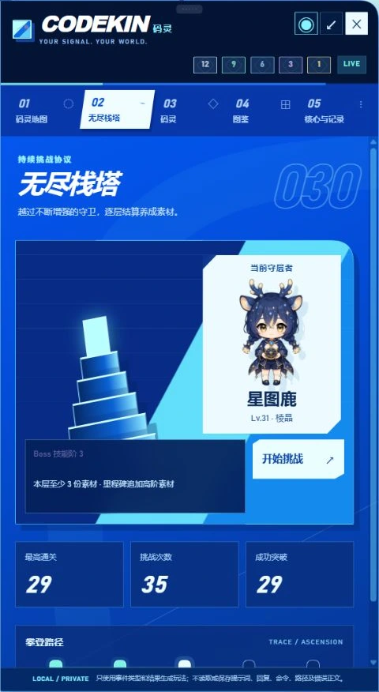
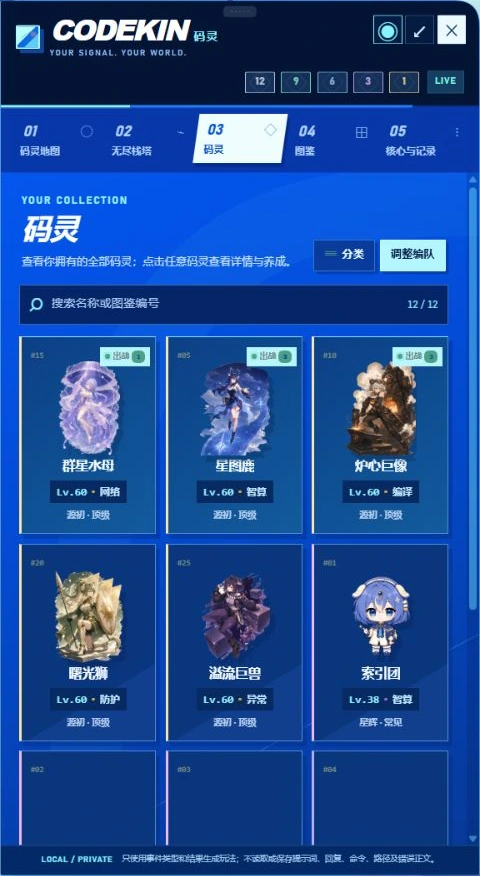

# 码灵（Codekin）

[English](README.md) · [npm 包](https://www.npmjs.com/package/@nath-vikky/dsh-codekin) · [GitHub 版本发布](https://github.com/Nath-Vikky/dsh-codekin/releases)

[游戏引擎与内容包架构](docs/architecture.zh-CN.md)

码灵是一款面向 DeepSeek Harness Web 的精灵收集与三消对战插件。它会将 DSH
运行过程中的高层结果转化为本地游戏事件，不修改提示词、工具、模型请求或 Agent 行为。

## 实机预览

以下画面直接截自运行在 DSH Web 中的码灵 `0.3.6` 稳定开发线。

<p align="center">
  
  
  
</p>

<p align="center"><sub>无尽栈塔 · 拥有码灵与出战标识 · 详情与养成</sub></p>

### 首批 25 只码灵


## 安装与启用

### DSH `0.1.2-rc.1` 预览版

码灵 `0.3.6-rc.1` 以 npm 发布在 `next` 标签下的 DSH `0.1.2-rc.1` 为开发与验证基线。它已经在
Windows 的 Node.js 22 和 24 下通过安装、带认证的浏览器交互、重启、卸载重装和存档保留测试。
请通过显式版本安装已经验证的构建：

```sh
pnpm dlx @deepseek-ai/dsh@0.1.2-rc.1 plugin --profile web add --ignore-scripts https://github.com/Nath-Vikky/dsh-codekin/releases/download/v0.3.6-rc.1/nath-vikky-dsh-codekin-0.3.6-rc.1.tgz
```

npm `latest` 仍为 `0.3.5-alpha.2`，属于此前的 DSH Alpha.2 基线。如需复现这套旧版 npm
组合，请同时锁定两个版本：

```sh
pnpm dlx @deepseek-ai/dsh@0.1.2-alpha.2 plugin --profile web add @nath-vikky/dsh-codekin@0.3.5-alpha.2
```

发布标签与活跃开发分支会提交经过检查的运行时 Bundle。

安装后重启 DSH Web，再前往 **DSH 设置 → 码灵** 启用插件。入口图标可以拖动，重复点击可
开关竖屏游戏窗口；挂机补给可领取时，入口会变成带有轻微动效的礼盒提醒。

码灵会把进度保存在 `$DSH_HOME/codekinsave/state.json`。旧版本的
`tracewild/state.json` 会在首次启动时自动迁移。通过 dsh-web 插件管理器即可二次确认后一键卸载，
默认会保留养成进度；如需彻底卸载，请先前往 **DSH 设置 → 码灵 → 删除本地存档**，再卸载插件。

该预览版已经迁移到 Alpha 的 Client 模块拆分结构，并接入官方浏览器认证 Cookie。码灵的状态、
操作、事件流和图片接口都会先拒绝未认证请求，再接触游戏状态。

此前可通过 npm 构建的源码线保留在 `stable/0.2.x` 分支。

### 当前稳定版 DSH

如果你仍在使用 DSH Web `0.1.0-rc.5`，请继续安装稳定版码灵 `0.2.0`：

```sh
dsh plugin --profile web add @nath-vikky/dsh-codekin@0.2.0
```

请不要把 Alpha 包安装到 rc.5。即使 npm `latest` 已转向 DSH Alpha 发布线，稳定版码灵 `0.2.0`
仍可通过显式版本继续安装。

## 核心循环

正常使用 DSH 即可。一次完成的活动最多产生一个遭遇，并可能奖励一个捕获核心。打开码灵后，
领取挂机补给、查看区域地图、选择野生目标、配置三只码灵编队，再进入 8×8 指令三消战斗。
胜利会掉落升级素材；将目标运行值压低后，可以结合目标剩余运行值和捕获核心品质尝试收容。
进度、地图遭遇、背包、编队与爬塔状态都保存在插件本地。

## 当前内容

- 30 级解锁纯外观进化，升级时平滑过渡到进化立绘；详情页右上角的衣架可按每只码灵选择原形或进化外观，选择会随存档保留，不影响属性、技能和奖励。
- 智算、编译、网络、防护、异常五类计算属性，以及首批 25 只精灵。
- 通过正常使用 DSH 获得的五种品质捕获核心。
- 由运行事件触发的遭遇；失败或恢复类事件可能对应较少见的精灵。
- 地图同时保留最多 7 只野生码灵；低品质目标驻留更久，高品质高等级目标会在较短窗口内离场。
- 混合属性对话仍只刷新一只码灵，但会优先补充候选属性中地图数量较少的一方；单一属性区域超过 5 只后，后续同类对话会向其他稀疏区域分流。
- 普通品质的野生等级根据整个背包分布生成，并保持在背包最低与最高等级之间；星辉与源初会作为高于背包上限的特殊挑战出现。
- 2D 区域地图、8×8 三消战斗、捕获、三只精灵编队和图鉴。
- 无尽栈塔玩法；层数提高后，Boss 等级、品质、机制和结算素材会逐步增强。
- 五类属性色块构成闭环克制关系；在同属性码灵回合内，分别触发运行修复、共享防护、智算同步、
  编译超频和异常穿透，在其他码灵回合内仍作为普通攻击珠参与克制结算。
- 1–100 级养成、五种品质升级素材、挂机补给与本地进度存档。
- 已拥有的码灵与编队编辑分开：三个唯一位置通过单独按钮进入调整并显式保存；卡片展示立绘、编号、等级、属性、品质色边框与出战位置。
- 码灵列表支持按属性和品质筛选，并可按等级升序或降序排列，同时避免把战斗数值堆叠在浏览卡片中。
- 点击码灵会打开可点空白处或红色叉号关闭的详情面板，集中展示战斗数值、技能和使用素材升级等养成功能。
- 可在 DSH“设置 → 码灵”中随时启停；停用时保留存档并暂停事件奖励与挂机计时。
- 编队中的码灵可经二次确认放生，并按自身品质返还一份升级素材；返还量不受等级影响。
- 每只出战码灵拥有三个基础行动；四连返还行动、五连增加行动，消除同属性色块可为队员积累指令值。
- 所有战斗都允许提前结束当前码灵的剩余行动；在野生遭遇中，这也能避免误杀低运行值目标并保留捕捉机会。
- 三名队员共享一条队伍运行值；伤害按阶段累计，并在队伍轮次结束时以醒目的总攻数字结算。每只精灵各有一个被动与一个主动技能。
- 恢复与护盾也会在我方或 Boss 的完整行动阶段内累计并统一结算；智算同步、编译超频和异常穿透则成为带作用范围与剩余回合提示的持续增幅。
- 野生码灵采用独立 Boss 数值，并会根据等级和品质使用危险珠、协议封锁、锁珠、冻结、棋盘重排与阶段防护层。
- 四连、五连与交叉消除会生成横排、竖排、爆破和源初特殊色块。
- 获得物品弹窗、悬浮信息、明确的素材经验值，以及放生等不可逆操作的二次确认。
- 由 Host 校验的游戏操作与原子化本地存档。

## 0.3.6-rc.1 兼容基线

- 运行时重新组合为确定性的无头引擎、经过校验的 Content API v1 注册表、官方核心内容包、
  DSH 适配层与独立 React 渲染层。
- 内容清单声明引擎 SemVer 范围、依赖、冲突、别名、资源和有界机制指令；不完整或有歧义的内容包会在游戏启动前被拒绝。
- 版本化存档封装会记录引擎和有序内容包身份，同时继续迁移旧存档，并为旧格式或身份不匹配的存档保留一次备份。
- 开发依赖与 Windows、macOS、Ubuntu 上 Node.js 22/24 的六组 CI 均锁定 npm 官方发布的 DSH `0.1.2-rc.1` 包。
- 与 Alpha.5 相比，RC.1 没有改变码灵所使用的 Host 或 Session 接口；码灵仍只消费 Host 的
  `session/event` 事件流，不枚举会话日志。
- 本兼容版本保留 Alpha.1 的玩法与内容集合，同时将开发、CI、打包和安装生命周期门禁全部切换到
  官方 RC.1 包族。
- 编队改为明确的三个唯一位置调整并保存；拥有的码灵以精简卡片浏览，数值、技能和素材升级统一迁移到可关闭的详情面板。
- 引擎状态、世界进度、存档恢复、码灵列表呈现与弹窗无障碍逻辑形成明确模块边界，后续内容和界面增量可以独立演进。
- 发布门禁会校验内容与资源、回放固定权威记录、运行七种场景的确定性战斗矩阵、限制性能和 Bundle 体积，并在隔离的 DSH Profile 中完成浏览器操作、重启、卸载与重装。
- 安装生命周期覆盖 Ubuntu + Node.js 22 与 Windows + Node.js 24 两个端点。
- 弹窗提供明确的可访问名称、键盘焦点闭环、适用场景下的 Escape 关闭，以及关闭后返回触发控件的焦点恢复。

## 0.3.2 战斗更新

- 指令棋盘升级为 8×8；点击和拖动时色块会稳定贴合棋盘，无效交换会静默复位，不再用技术错误打断战斗。
- 当前行动码灵会显示醒目的聚焦光效；统一的 `SKIP` 按钮同时适用于野生遭遇与无尽栈塔。
- 每次玩家消除都会短暂显示按克制关系着色的本次伤害，随后收束为最终 `TOTAL DAMAGE`；Boss 行动则使用同样清晰的
  `ENEMY DAMAGE` 反馈，并适当放慢行动节奏。
- 双方攻击都会先播放光波命中特效，再结算运行值变化或战败；敌方阶段会用红色警戒条锁定棋盘，直到 Boss 的全部行动结束。
- 恢复、护盾、伤害预警和运行值变化会在血条中平滑动画；持续攻击、防御与属性增幅改为紧凑图标，并可查看作用范围、数值与剩余回合。
- 敌方意图与 Boss 技能保持为血条旁的短条，通过游戏内悬浮卡片显示细节，不再与浏览器原生提示重叠。

## 战斗与遭遇规则

交换相邻色块来累积队伍算力，并为相同属性的队员积累指令值。同属性回合中，防护珠与网络珠会
牺牲普通伤害，先累积整轮恢复和护盾预算；智算、编译、异常珠则分别形成全队、单体或对手范围的持续增幅。每名队员通常拥有三个行动；
直接四连返还一次行动，五连额外增加一次行动。三名队员的阶段伤害分别展示，最后统一结算一次
队伍总攻；队伍生存则由三者最大运行值相加形成的共享血条决定。野生 Boss 有自己的多段行动循环，
会结算一次共享队伍攻击，并使用危险珠、协议封锁、锁珠、冻结、防护层和随品质变化的棋盘机制。
玩家可以在任意战斗中提前结束当前队员阶段；野生遭遇中可借此避免误杀已经压低运行值的收容目标。遭遇
驻留时间、等级与品质会参考有效 DSH 活动；地图容量和区域平衡规则则避免单一活动类型占满全部刷新位。

## 数据说明

游戏进度保存在本地的 `$DSH_HOME/codekinsave/state.json`。码灵只记录有界的游戏事件与聚合后的
运行结果，不保存提示词正文、助手回复、工具参数、命令、工作区路径或原始错误内容。它不会提交提示词、调用工具、修改模型请求
或改变会话内容。磁盘存档封装会记录自身格式、引擎版本和有序内容包身份，并继续自动迁移此前的裸状态存档。

## 兼容性与状态

- `0.2.0`：适配 DeepSeek Harness Web `0.1.0-rc.5` 的稳定固定版本。
- `0.3.6-rc.1`：当前面向 `@deepseek-ai/dsh@0.1.2-rc.1`（`next`）的 GitHub Latest 兼容基线。
- `0.3.6-alpha.3`：此前面向 `@deepseek-ai/dsh@0.1.2-alpha.5` 的 GitHub Latest 兼容基线。
- `0.3.6-alpha.2`：此前面向 DSH Alpha.4 的基线；其原始发布附件同样通过了 Alpha.5 生命周期测试。
- `0.3.6-alpha.1`：更早面向 DSH Alpha.4 的 GitHub 稳定基线。
- `0.3.5-alpha.2`：当前 npm `latest`，也是此前面向 DSH Alpha.2 的引擎/内容包版本。
- `0.3.5-alpha.1`：此前的 GitHub 引擎/内容包 Alpha 版。
- `0.3.2`：此前面向 DSH Alpha.2 基线的战斗系统 GitHub 预发行版。

预发行版本已经在隔离的官方 npm Profile 中验证安装、Client 组合、带认证的状态/操作/资源访问、
浏览器与键盘交互、Host 重启，以及卸载和重装后的存档保留。由于上游预发行 API 在下一个稳定版
之前仍可能变化，本版本仍标记为兼容性预览版。

## 许可证

MIT
